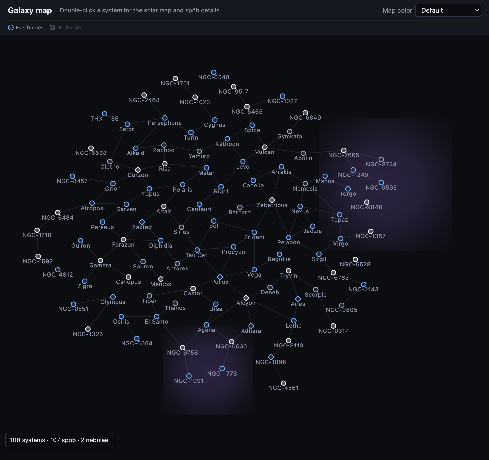

# ResForge


## About the upstream project

[ResForge](https://github.com/andrews05/ResForge) (Andrew Clunis) is a resource editor for macOS for classic resource forks and related formats. It descends from [ResKnife](https://github.com/nickshanks/ResKnife) and has been rebuilt for current macOS APIs and tooling. At its core it is a general-purpose resource workflow—hex and template editing, image/sound/dialog/menu editors—with strong support for *Escape Velocity Nova* plug-ins (Rez, templates, and dedicated Nova tools).

This repository is a **fork** that keeps that upstream baseline and layers additional tooling and small app improvements on top.

## Additions in this fork

### Galaxy export (`galaxy-export`)

A command-line tool (Swift package executable in `Plugins`, product name `galaxy-export`) reads a Nova **Rez** file’s resource map and writes a single JSON document for use by other tools. The export includes:

- **Systems** (`sÿst`) — coordinates, hyperlinks, nav-default stellar list, and optional environment block (dude types, traffic probabilities, government, asteroids, interference, etc.).
- **Space objects** (`spöb`) — names, local positions, sprite/type info, flags, tech, defense fleet encoding, government bindings, and related fields needed for richer UI.
- **Nebulae** (`nëbu`) — placement and size.
- **Governments** (`gövt`) — id → name map for legends and labels.

Build from the repo root:

```bash
cd Plugins && swift build -c release --product galaxy-export
```

Run (pretty-print optional):

```bash
Plugins/.build/release/galaxy-export [--pretty] path/to/data.rez [out.json]
```

If you omit the output path, the tool writes `data.json` next to the input file.

### Web galaxy map (`galaxy-map`)

A small **React + Vite** app loads that JSON (by default `public/galaxy.json`) and draws an interactive SVG map: system nodes, hyper routes, nebula regions, and a simple legend. **Double-click** a system to open a detail view with the in-system layout and stellar (`spöb`) data. **Map color** modes recolor systems by commodity buy/sell spreads, controlling government, tech and services coverage, or stellar count—useful for balancing and review passes outside the Mac app.



Run locally:

```bash
cd galaxy-map && npm install && npm run dev
```

Place or symlink your exported JSON as `galaxy-map/public/galaxy.json`, or export straight into that path from `galaxy-export`.

### Other fork changes

Various editor and plug-in tweaks land here as well—for example **Show Info** on selected resources in the outline, and expanded **image resource** decoding (including additional RLE and 8/32-bit paths) aligned with Nova-era assets.

## Installation

Download builds from the [Releases](https://github.com/DanFessler/ResForge/releases) page on this fork (or build from source). ResForge targets macOS 11 or later on Intel and Apple Silicon.

## Features (ResForge)

* Hexadecimal editor, powered by [HexFiend](https://github.com/HexFiend/HexFiend).
* Template editor, supporting a wide array of [field types](https://github.com/andrews05/ResForge/tree/master/Plugins/Sources/TemplateEditor#template-editor).
  * User-defined templates, loaded automatically from resource files in `~/Library/Application Support/ResForge/`.
  * Template-driven bulk data view, with CSV import/export.
  * Generic binary file editor, via the `Open with Template…` menu item.
* Image editor, supporting 'PICT', 'PNG ', 'PNGf', 'cicn' & 'ppat' resources, plus view-only support for a variety of icons and other bitmaps.
* Sound editor, supporting sampled 'snd ' resources.
* Dialog editor, supporting 'DITL' resources.
* Menu editor, supporting 'MENU', 'CMNU' & 'cmnu' resources.
* Tools for EV Nova, including powerful templates for all types and a number of graphical editors.

### Supported File Formats

* Macintosh resource format, in either resource fork or data fork.
* Rez format, used by EV Nova.
* Extended resource format, defined by [Graphite](https://github.com/TheDiamondProject/Graphite).
* MacBinary encoded resource fork.
* AppleSingle/AppleDouble encoded resource fork.

## Built With

* [HexFiend](https://github.com/HexFiend/HexFiend) - Powers the hexadecimal editor.
* [CSV.swift](https://github.com/yaslab/CSV.swift) - Provides reading/writing of CSV files.
* [swift-parsing](https://github.com/pointfreeco/swift-parsing) - Provides parsing of custom DSLs.

## Similar Projects

* [resource_dasm](https://github.com/fuzziqersoftware/resource_dasm) - CLI tools for disassembling resource files.

## License

Distributed under the MIT License. See `LICENSE` for more information.
